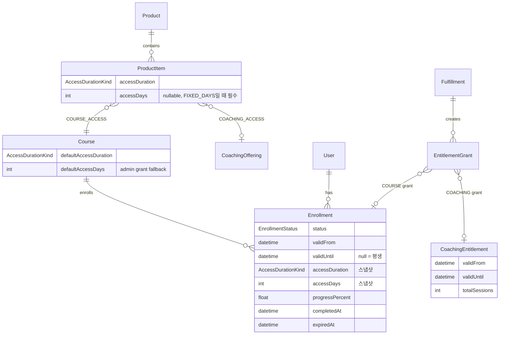

# LMS 수강 권한(Access) 설계

> **목표:** 강의(VOD) 상품에 **기간 기반 수강 권한**을 부여하고, **학습 완료(`COMPLETED`)** 와 **접근 만료(`EXPIRED`)** 를 분리한다.  
> 코칭(`CoachingEntitlement`)과 동일한 **Catalog → Instance → Grant** 패턴을 따른다.
>
> **구현 정책 (2026-07):** [lms-access-implementation.md](./lms-access-implementation.md)  
> **전체 정책 허브:** [policies.md](./policies.md)

---

## 1. 문제 정의

| 축 | 의미 | 현재 | 목표 |
|----|------|------|------|
| **Access** | 레sson/플레이어에 들어갈 수 있는가 | `Enrollment.status = ACTIVE`만 허용 | `validUntil` + status로 판단 |
| **Progress** | 커리큘럼을 끝까지 봤는가 | `progressPercent`, `COMPLETED` | 유지 (접근과 분리) |
| **Catalog** | 상품이 어떤 조건으로 팔리는가 | 기간 없음 | 90일 / 평생 등 SKU별 정의 |

**버그:** 100% 완료 시 `status = COMPLETED` → `getEnrollmentForCourse`가 ACTIVE만 조회 → 404.  
**원인:** 완료 상태를 접근 거부로 오용.

**기획:** 「90일 동안 무제한 다시보기」, 「평생 수강」 — LMS 표준 **access window** 개념.

---

## 2. 설계 원칙

1. **Access ≠ Progress** — 수료 후에도 기간 내면 복습 가능.
2. **Catalog 스냅샷** — 구매 시점의 기간 정책을 `Enrollment`에 고정 (상품 수정 후에도 기존 구매자 권리 보호).
3. **코칭과 대칭** — `validFrom` / `validUntil`, grant 추적, status enum 패턴 재사용.
4. **SKU 단위 정책** — 동일 코스라도 상품마다 다른 기간 (90일 vs 평생).
5. **1 User × 1 Course = 1 Enrollment** — 재구매·연장은 기존 row 갱신 (진도 보존).

---

## 3. 도메인 모델



---

## 4. Catalog — 판매 조건 정의

### 4.1 `AccessDurationKind`

| 값 | 의미 |
|----|------|
| `LIFETIME` | 기간 제한 없음 (`validUntil = null`) |
| `FIXED_DAYS` | 구매(또는 연장)일로부터 N일 (`accessDays` 필수, > 0) |

### 4.2 `ProductItem` (COURSE_ACCESS)

강의 SKU별 수강 기간. **번들 내 코스 아이템마다 독립 설정 가능.**

```prisma
accessDuration AccessDurationKind @default(LIFETIME)
accessDays     Int?               // FIXED_DAYS일 때 필수
```

- `COACHING_ACCESS` 아이템은 무시 → `CoachingOffering.validDays` 사용 (기존 유지).

### 4.3 `Course.defaultAccessDuration` / `defaultAccessDays`

- Admin 수동 부여(`adminGrantCourseAccess`) 등 **Product 없이** enrollment 생성 시 fallback.
- ProductItem에 명시값이 있으면 **ProductItem 우선**.

### 4.4 코칭과의 대칭

| | VOD (Course) | Coaching |
|--|--------------|----------|
| Catalog 기간 | `ProductItem.accessDuration` + `accessDays` | `CoachingOffering.validDays` |
| Catalog 소진 | 없음 (기간 내 무제한 재생) | `totalSessions` 회차 |
| Instance | `Enrollment` | `CoachingEntitlement` |
| Instance 기간 | `validFrom`, `validUntil?` | `validFrom`, `validUntil` |
| Grant | `EntitlementGrant` → `enrollmentId` | `EntitlementGrant` → `coachingEntitlementId` |

---

## 5. Instance — `Enrollment` 확장

### 5.1 추가 필드

| 필드 | 설명 |
|------|------|
| `validFrom` | **현재** 수강 권한 구간 시작 (연장·재구매 시 갱신 가능) |
| `validUntil` | 권한 종료 시각. `null` = 평생 |
| `accessDuration` | 부여 시점 Catalog 스냅샷 |
| `accessDays` | 부여 시점 일수 스냅샷 (`LIFETIME`이면 null) |
| `expiredAt` | `EXPIRED` 전환 시각 (감사·UI용, nullable) |

기존 `enrolledAt` = **최초 등록일** (변경하지 않음, 리포트용).

### 5.2 `EnrollmentStatus` 의미

| Status | 접근 | 설명 |
|--------|------|------|
| `ACTIVE` | ✅ (기간 내) | 수강 중, 100% 미만 |
| `COMPLETED` | ✅ (기간 내) | 커리큘럼 100% 완료 (**복습 가능**) |
| `EXPIRED` | ❌ | `validUntil` 경과 |
| `DROPPED` | ❌ | 환불·탈퇴 등 |
| `SUSPENDED` | ❌ | 관리자 정지 |

> `COMPLETED`는 **수료**, `EXPIRED`는 **기간 만료**. 서로 다른 축.

---

## 6. 접근 판단 (앱 레벨 계약)

```typescript
function canAccessEnrollment(e: Enrollment, now = new Date()): boolean {
  if (e.status === "DROPPED" || e.status === "SUSPENDED") return false;
  if (e.status === "EXPIRED") return false;
  if (e.validUntil && now > e.validUntil) return false;
  return true; // ACTIVE, COMPLETED
}

function resolveEnrollmentStatus(e: Enrollment, now = new Date()): EnrollmentStatus {
  if (e.status === "DROPPED" || e.status === "SUSPENDED") return e.status;
  if (e.validUntil && now > e.validUntil) return "EXPIRED";
  if (e.progressPercent >= 100 && e.completedAt) return "COMPLETED";
  return "ACTIVE";
}
```

- Lazy: 레sson 진입 시 `validUntil` 지났으면 `EXPIRED` materialize.
- Batch (optional): cron으로 `validUntil < now` → `EXPIRED` 일괄 갱신.

**조회:** `getEnrollmentForCourse`는 `canAccessEnrollment` 통과 enrollment 반환.  
`COMPLETED` 포함, `EXPIRED`/`DROPPED`/`SUSPENDED` 제외.

---

## 7. Fulfillment 시맨틱

### 7.1 최초 부여 (create)

```
accessDuration, accessDays ← ProductItem (없으면 Course default)
validFrom                  ← now
validUntil                 ← FIXED_DAYS ? now + accessDays : null
status                     ← ACTIVE
```

### 7.2 재구매 / 연장 (upsert update)

동일 `userId + courseId` enrollment 존재 시:

| 상황 | 동작 |
|------|------|
| ACTIVE/COMPLETED + 아직 유효 | `validUntil = max(validUntil, now) + accessDays` (연장) |
| EXPIRED | `validFrom = now`, `validUntil = now + accessDays`, `status = ACTIVE` (진도 유지) |
| FIXED → LIFETIME 구매 | `validUntil = null`, `accessDuration = LIFETIME` |
| LIFETIME → FIXED | **v1 미지원** — `skip` 처리, 다운그레이드 없음 |

`progressPercent`, `LessonProgress`, `completedAt`는 **절대 초기화하지 않음**.

### 7.3 환불 revoke

- `status = DROPPED` (또는 별도 REVOKED 추가 검토 — v1은 DROPPED)
- `validUntil = now` (즉시 차단)
- Fulfillment `REVOKED` (기존)

### 7.4 Admin 수동 부여

- `validDays` 파라미터 optional → 없으면 `Course.defaultAccess*`
- Audit log `ENROLLMENT_GRANTED` metadata에 `accessDays` 포함

---

## 8. 인덱스

```prisma
@@index([userId, status])
@@index([validUntil])
@@index([courseId, status])
```

- 만료 배치: `WHERE validUntil IS NOT NULL AND validUntil < ? AND status IN ('ACTIVE','COMPLETED')`
- 내 강의: `userId + status IN (ACTIVE, COMPLETED)`

---

## 9. 마이그레이션 / 백필

| 대상 | 백필 값 |
|------|---------|
| 기존 `Enrollment` | `accessDuration = LIFETIME`, `validFrom = enrolledAt`, `validUntil = null` |
| 기존 `ProductItem` (COURSE) | `accessDuration = LIFETIME` |
| 기존 `Course` | `defaultAccessDuration = LIFETIME` |

→ 기존 사용자 접근 권한 **변경 없음**.

Seed 예시 (데모):

- `nextjs-vod-only`: `FIXED_DAYS`, 90일
- 번들 코스 아이템: `LIFETIME` (패키지 혜택)

---

## 10. UI / API 후속

> 상세 정책·Shop 매트릭스: [lms-access-implementation.md](./lms-access-implementation.md)

- [x] `grantCourseAccess` / seed / admin grant에 기간 스냅샷 적용
- [x] `getEnrollmentForCourse` — COMPLETED 허용 + `canAccessEnrollment`
- [x] 기간 만료 전용 페이지 (404 대신)
- [x] Learning 카드: `D-N` / `평생` / `수료 · D-N`
- [x] Shop 상품 설명 — 「N일 무제한 수강」/ 「평생 수강」
- [x] Shop CTA — extend / restore / upgrade / partial / owned
- [x] Checkout 가드 — `ALREADY_OWNED` (409)
- [ ] Admin ProductItem 편집 UI — accessDuration, accessDays

---

## 11. 2차 확장 (미포함)

| 기능 | 방향 |
|------|------|
| 케이스별 할인 SKU / 쿠폰 | 의도별 product slug 또는 `Order.discount` + Coupon |
| Drip (순차 공개) | `Lesson.releaseAt` 또는 `ModuleReleaseSchedule` |
| 일시정지 | `Enrollment.pausedUntil` |
| 연장 이력 | `EnrollmentAccessEvent` (grant, extend, expire, revoke) |
| 코칭 평생 | `CoachingOffering.validDays` nullable + `AccessDurationKind` 통일 |
| 업그레이드 차액 결제 | 과거 OrderLine 기준 proration |

---

## 12. 요약

- **Catalog:** `ProductItem.accessDuration` + `accessDays` (SKU별)
- **Fallback:** `Course.defaultAccessDuration` + `defaultAccessDays`
- **Instance:** `Enrollment.validFrom` / `validUntil` + 스냅샷 필드
- **Status:** `COMPLETED` = 수료 (접근 O), `EXPIRED` = 기간 만료 (접근 X)
- **Grant:** `EntitlementGrant` → `Enrollment` (기존 구조 유지)
