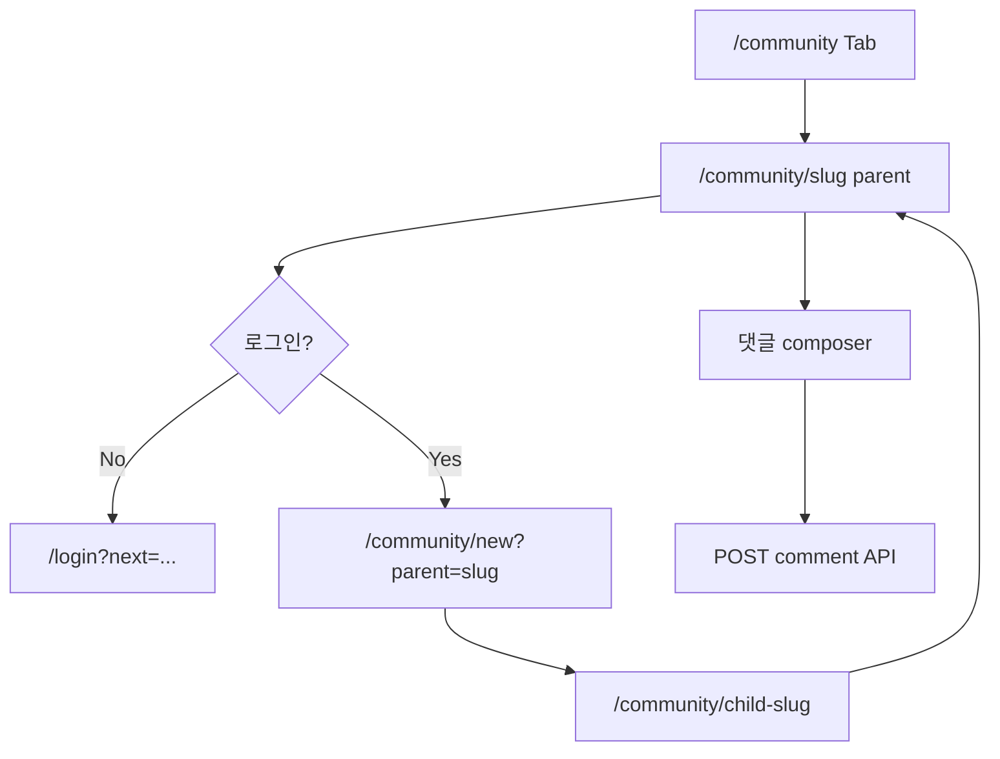

# Flow — 커뮤니티 챌린지 (부모글 → 하위글)

## 용어

| 기획 | 시스템 |
|------|--------|
| 챌린지 인증글 | Post with `parentPostId` |
| 부모 POST | root post (`parentPostId = null`) |

## v2 (기획)

- 부모 상세에서 하위글 **7개**만 노출 → 더보기 페이지

화면: [community-list.md](../community-list.md), [community-post.md](../community-post.md)
