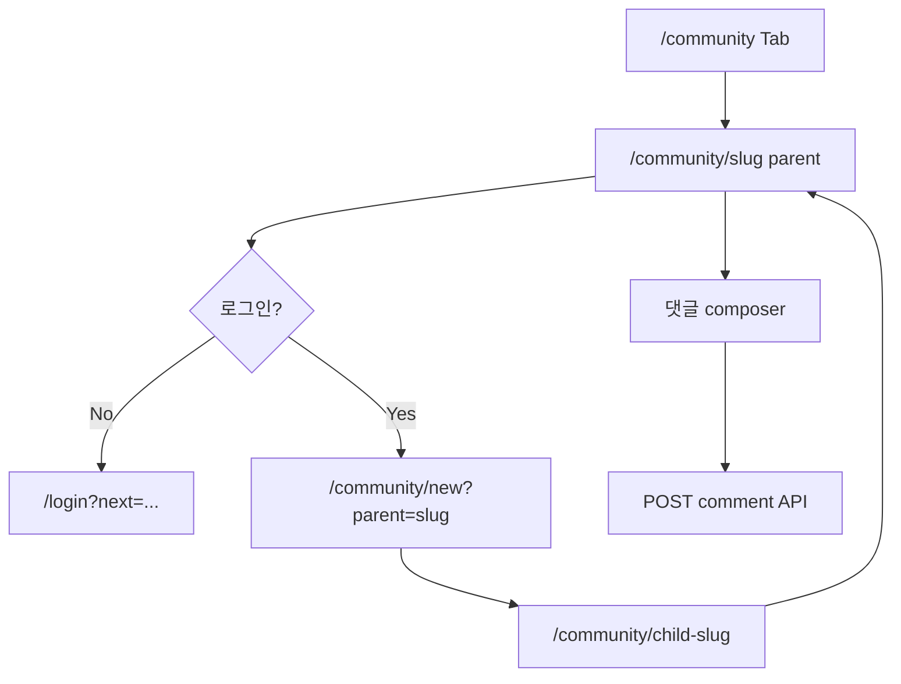

# Flow — 커뮤니티 챌린지 (원본 글 → 인증 글)

## 용어

| UI | 시스템 |
|------|--------|
| 인증 글 | Post with `parentPostId` |
| 원본 글 | root post (`parentPostId = null`) |

## v2 (기획)

- 원본 글 상세에서 인증 글 **7개**만 노출 → 더보기 페이지

화면: [community-list.md](../community-list.md), [community-post.md](../community-post.md)
