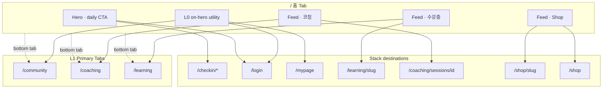

# Home IA — `/`

> **SSOT:** 홈 화면 정보 구조·우선순위·내비게이션 그래프.  
> **화면 명세:** [home.md](../home.md) · **Chrome:** [navigation-chrome-policy.md](../../navigation-chrome-policy.md)

---

## 1. 홈의 역할 (앱 내 위치)

| 축 | 정의 |
|----|------|
| **Navigation** | L1 Primary Tab — 「홈」 (`/`) |
| **Job** | Daily habit anchor (체크인) + **개인화 shortcut hub** |
| **Audience** | 전체 (비로그인 = Shop discovery, 로그인 = 개인 피드) |
| **Not home** | 풀 목록·설정·장문 콘텐츠 — 각 Stack/Tab 전용 화면 |

홈은 **요약·바로가기**만 담당한다. 수강 전체 목록 → `/learning`, 코칭 전체 → `/coaching`, Shop catalog → `/shop`.

---

## 2. 정보 계층 (Z-order)

```
┌─────────────────────────────────────────────────────────┐
│ L0  Global chrome (Mobile: on-hero only)                │
│     워드마크 · 커뮤니티 · 마이/로그인                      │
├─────────────────────────────────────────────────────────┤
│ L1  Hero — PRIMARY ACTION                               │
│     인사 · 오늘 날짜 · 데일리 체크인 CTA (1개)            │
├─────────────────────────────────────────────────────────┤
│ L2  Feed panels (stack, 우선순위 순)                     │
│     ├─ [조] 수강중 강좌    (로그인, ACTIVE≥1)             │
│     ├─ [조] 코칭 세션      (로그인, session≥1)            │
│     └─ [항] 추천 상품      (catalog≥1)                    │
├─────────────────────────────────────────────────────────┤
│ L3  Feed rows (패널 내 list item, max N)                │
└─────────────────────────────────────────────────────────┘
│ L1  Bottom tab bar (Mobile) / Inline nav (Desktop)      │
└─────────────────────────────────────────────────────────┘
```

**원칙**

1. **Hero = 1 primary CTA** — 체크인만. 다른 habit(주간)은 checkin hub.
2. **Feed = secondary** — 스크롤 후 discover; 패널 0건이면 **섹션 자체 제거** (빈 카드 없음).
3. **개인화 > catalog** — 로그인 시 수강·코칭이 Shop 위.
4. **Shop = fallback discovery** — 비로그인·신규 사용자도 monetization 경로 유지.

---

## 3. 콘텐츠 우선순위 & 슬롯

| 순위 | 패널 | Max rows | 노출 조건 | More link |
|------|------|----------|-----------|-----------|
| 1 | 수강중 강좌 | 3 | `user` + ACTIVE enrollment | `/learning` |
| 2 | 코칭 세션 | 5 | `user` + coaching session | `/coaching` |
| 3 | 추천 상품 | 3 | active product | `/shop` |

### Reserved (v2 — 홈 미포함)

| 슬롯 | 후보 | 비고 |
|------|------|------|
| Live digest | 예정/진행 중 라이브 1~2건 | coach/live product 연동 후 |
| Community digest | 팔로우·챌린지 인증 | Tab `/community`와 중복 최소화 |
| Check-in streak | 연속 기록 배지 | Hero 또는 feed 상단 |
| Notifications | 답변 대기·마감 | in-app inbox v2 |

---

## 4. 상태별 IA 트리

### 비로그인

```
/ (Home)
├── L0: 워드마크 · 커뮤니티 · 로그인
├── Hero: generic greeting · login CTA
└── Feed
    └── 추천 상품 (0~3) → /shop/[slug]
```

### 로그인 · 풀 피드

```
/ (Home)
├── L0: 워드마크 · 커뮤니티 · 마이페이지
├── Hero: {name} greeting · daily CTA → form | report
└── Feed
    ├── 수강중 (0~3) → /learning/[slug]
    ├── 코칭 (0~5) → /coaching/sessions/[id] | /coaching
    └── 추천 상품 (0~3) → /shop/[slug]
```

### 로그인 · sparse (수강·코칭 없음)

```
/ (Home)
├── Hero (동일)
└── Feed
    └── 추천 상품 only
```

---

## 5. 내비게이션 그래프



---

## 6. Mobile vs Desktop IA 차이

| 영역 | Mobile | Desktop |
|------|--------|---------|
| L0 | Hero에 integrated (`on-hero`) | Unified header — 분리 |
| Hero utility | 커뮤니티·프로필 아이콘 | Header auth only; 커뮤니티는 L1 nav |
| Hero layout | full-bleed gradient | contained band below header |
| L1 | Bottom tab (홈·커뮤니티·코칭·내학습) | Header inline primary nav |
| Feed | 동일 순서·동일 데이터 | 동일 (max-width column) |

**IA 동일, chrome만 다름** — 콘텐츠 트리·링크 대상은 viewport 무관.

---

## 7. 인접 화면과 경계

| 화면 | 홈과 관계 |
|------|-----------|
| `/learning` Tab | 수강 **전체** 목록·코칭 허브 entry — 홈 feed는 top 3 shortcut |
| `/coaching` Stack | 코칭권·회차 **전체** — 홈은 recent 5 |
| `/checkin` Stack | daily/weekly **허브** — Hero는 today daily deep link only |
| `/shop` Stack | catalog **전체** — 홈은 featured 3 |
| `/community` Tab | 피드·글 목록 — 홈 L0 아이콘으로 shortcut only |
| `/mypage` Stack | 계정·설정 — Hero secondary |

---

## 8. 결정 로그

| 날짜 | 결정 | 근거 |
|------|------|------|
| v1 | Feed 순서: 수강 → 코칭 → Shop | 개인화 engagement > commerce |
| v1 | 0건 섹션 omit | 홈은 hub not empty state museum |
| v1 | Hero CTA = daily only | 단일 habit; weekly는 checkin hub |
| v1 | 코칭 unpublished → list | detail 미공개 콘텐츠 보호 |
| v2 TBD | Live/community digest | Tab 중복·signal/noise tradeoff |

---

## 9. 체크리스트 (IA 변경 시)

- [ ] [home.md](../home.md) Block·상태 매트릭스 동기화
- [ ] Feed 순위/조건 변경 → §3 슬롯 표 갱신
- [ ] 새 outbound link → §5 연결 & Mermaid §5
- [ ] Chrome 변경 → [navigation-chrome-policy.md](../../navigation-chrome-policy.md)
- [ ] Reserved → v2 슬롯 표로 이동 또는 구현 후 제거
