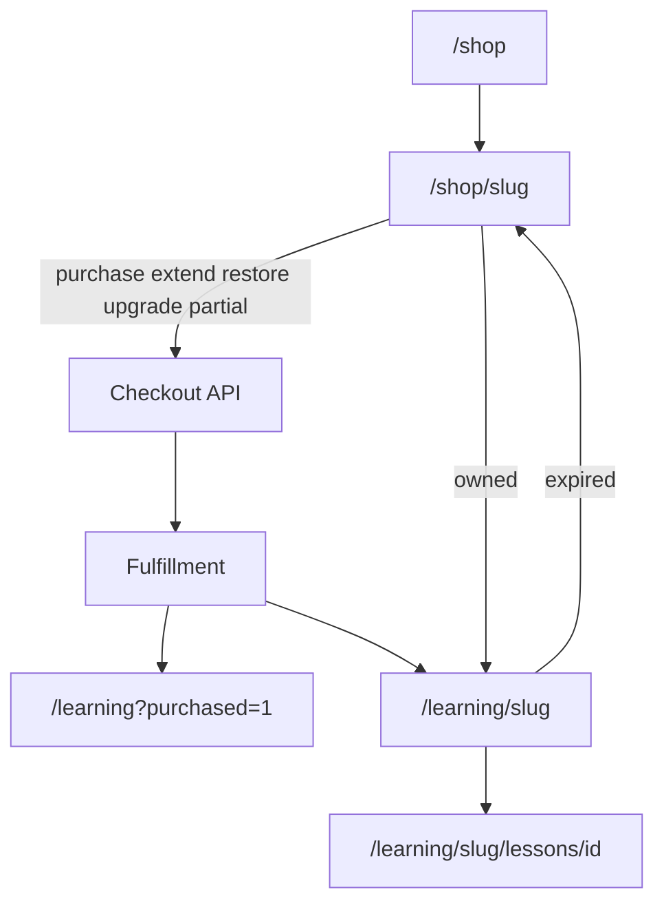

# Flow — Shop → Learning → Lesson

## Fulfillment 결과

| Action | User-visible |
|--------|----------------|
| grant | 신규 enrollment + 코칭 entitlement |
| renew | 기간 연장, 진도 유지 |
| upgrade | LIFETIME 전환 |
| skip | 해당 item 변경 없음 |

## Shop CTA → action 매핑

| ProductShopState | Fulfillment tendency |
|------------------|---------------------|
| purchase | grant |
| extend / restore | renew |
| upgrade | upgrade |
| partial | course skip + coaching grant |
| owned | — (checkout blocked) |

상세: [lms-access-implementation.md](../lms-access-implementation.md) §5–6  
화면: [shop-product.md](../shop-product.md), [learning-tab.md](../learning-tab.md)
